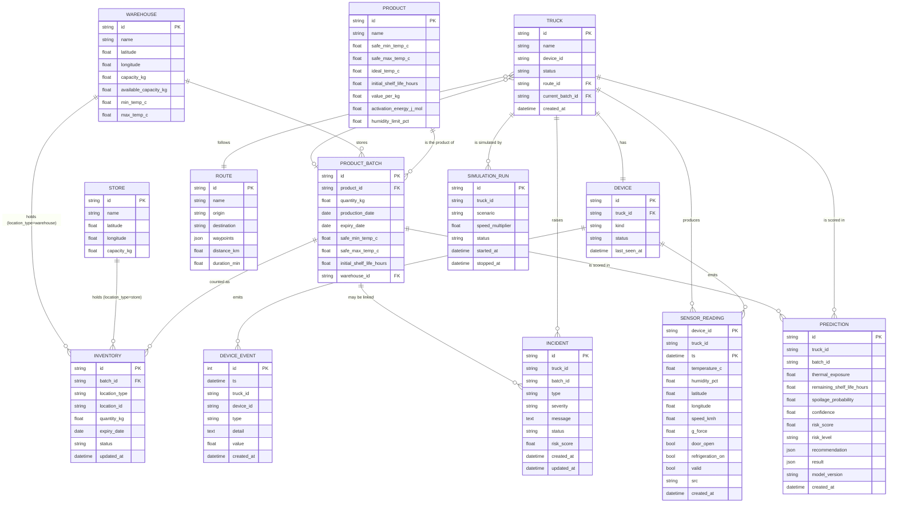

# Domain Model — Cold-Chain Intelligence

> Single source of truth for domain objects, fields, types and relationships.
> Persisted objects come from `backend/models.py`; the embedded result shapes
> come from `backend/intelligence/`. Wire examples are in
> [`API_CONTRACT.md`](API_CONTRACT.md).

## 1. How to read this document

- **Persisted table** — a real SQLAlchemy table in `backend/models.py`.
- **Embedded shape** — a JSON object stored inside a column (or returned by the
  engine); no table of its own.
- Types are Python/SQLAlchemy types. `str | None` means nullable.
- All timestamps are timezone-aware UTC. Currency is **QAR**.

## 2. Entity-relationship overview (ASCII)

```
                 ┌──────────────┐
                 │   Product    │
                 │  id (PK)     │
                 └──────┬───────┘
                        │ 1
                        │ product_id
                        │ N
                 ┌──────▼────────┐        warehouse_id        ┌──────────────┐
                 │ ProductBatch  │◀──────────────────────────│  Warehouse   │
                 │  id (PK)      │                           │  id (PK)     │
                 └───┬───────┬───┘                           └──────────────┘
          current_batch_id  │ batch_id                             ▲
                     │      │                                      │ location_id
              ┌──────▼───┐  │                              ┌───────┴────────┐
              │  Truck   │  │                              │   Inventory    │
              │  id (PK) │  │                              │  id (PK)       │
              └──┬────┬──┘  │                              └────────────────┘
      device_id  │    │ route_id
                 │    │
        ┌────────▼─┐  │                    ┌──────────────┐
        │  Device  │  │                    │    Store     │
        │  id (PK) │  │                    │  id (PK)     │
        └────┬─────┘  │                    └──────────────┘
             │ emits  │  carries
             │        └───────┐
             ▼                ▼
   ┌────────────────┐  ┌──────────────┐   ┌────────────────┐
   │ SensorReading  │  │  Incident    │   │ SimulationRun  │
   │ (device_id,ts) │  │  id (PK)     │   │  id (PK)       │
   └────────────────┘  └──────────────┘   └────────────────┘
             │
             ▼ (via context → engine)
   ┌────────────────┐
   │  Prediction    │
   │  id (PK)       │
   │  ├─ Recommendation (embedded)
   │  ├─ OptimizationResult (embedded, in result.optimization)
   │  └─ FoodLossResult (embedded, in result.foodLoss)
   └────────────────┘
```

Relationship sentences:

- A **Truck** has one **Device** and one current **ProductBatch**.
- A **Truck** follows one **Route**.
- A **ProductBatch** references one **Product** and may sit in one **Warehouse**.
- An **Inventory** row references one **ProductBatch** at a `warehouse` or `store`
  location.
- A **Truck** produces many **TelemetryReading** (`SensorReading`) rows, keyed by
  `(device_id, timestamp)`.
- A **Device** emits many **DeviceEvent** rows — typed change events, distinct
  from sampled telemetry.
- A **Truck** (and optionally a batch) produces many **Incident** rows.
- A **ProductBatch** has a **Prediction** (the latest one wins).
- A **Prediction** embeds a **Recommendation**; its full `result` embeds an
  **OptimizationResult** and a **FoodLossResult**.
- A **SimulationRun** records a scenario command for one truck (or all trucks).

## 3. Persisted tables

### 3.1 Truck

| Field | Type | Notes |
|---|---|---|
| `id` | `str` | **PK**. e.g. `T102` |
| `name` | `str` | e.g. `Truck T102` |
| `device_id` | `str` | unique; → `Device.id` |
| `status` | `str` | default `active` |
| `route_id` | `str \| None` | FK → `Route.id` |
| `current_batch_id` | `str \| None` | FK → `ProductBatch.id` |
| `created_at` | `datetime` | server default `now()` |

### 3.2 Device

| Field | Type | Notes |
|---|---|---|
| `id` | `str` | **PK**. e.g. `TRUCK-T102` |
| `truck_id` | `str` | FK → `Truck.id`, not null |
| `kind` | `str` | default `dht_gps` |
| `status` | `str` | default `online` (seed sets `offline`) |
| `last_seen_at` | `datetime \| None` | updated on every stored reading |

### 3.3 TelemetryReading (`SensorReading`)

Composite primary key `(device_id, ts)` so the table can be a TimescaleDB
hypertable. Index `ix_sensor_readings_truck_ts` on `(truck_id, ts)`.

| Field | Type | Notes |
|---|---|---|
| `device_id` | `str` | **PK part** |
| `truck_id` | `str` | not null |
| `ts` | `datetime` | **PK part**, UTC |
| `temperature_c` | `float \| None` | °C |
| `humidity_pct` | `float \| None` | 0–100 |
| `latitude` | `float \| None` | |
| `longitude` | `float \| None` | |
| `speed_kmh` | `float \| None` | |
| `g_force` | `float \| None` | |
| `door_open` | `bool` | default `false` |
| `refrigeration_on` | `bool` | default `true` |
| `valid` | `bool` | default `true` |
| `src` | `str` | default `sim` |
| `created_at` | `datetime` | server default `now()` |

### 3.4 DeviceEvent

A typed thing a device reported between telemetry ticks. Telemetry says *what
the sensors read*; an event says *what happened* (a door opened, the unit
tripped). Index `ix_device_events_truck_ts` on `(truck_id, ts)`.

| Field | Type | Notes |
|---|---|---|
| `id` | `int` | **PK**, autoincrement |
| `ts` | `datetime` | event time, UTC; indexed |
| `truck_id` | `str` | not null |
| `device_id` | `str \| None` | |
| `type` | `str` | closed vocabulary, see below |
| `detail` | `str` (Text) | default `""`; scenario or cause |
| `value` | `float \| None` | optional numeric payload |
| `created_at` | `datetime` | server default `now()` |

Allowed `type` values (`backend/ingest/events.py`): `DOOR_OPENED`,
`DOOR_CLOSED`, `REFRIGERATION_ON`, `REFRIGERATION_OFF`, `SHOCK`, `POWER_LOST`,
`POWER_RESTORED`, `SENSOR_FAULT`, `SCENARIO_CHANGED`. Unknown types are
rejected, not stored.

### 3.5 Product

| Field | Type | Notes |
|---|---|---|
| `id` | `str` | **PK**. `chicken` \| `milk` \| `lettuce` |
| `name` | `str` | e.g. `Fresh Chicken` |
| `safe_min_temp_c` | `float` | |
| `safe_max_temp_c` | `float` | |
| `ideal_temp_c` | `float` | Arrhenius reference temperature |
| `initial_shelf_life_hours` | `float` | |
| `value_per_kg` | `float` | QAR per kg |
| `activation_energy_j_mol` | `float` | default `80000.0` |
| `humidity_limit_pct` | `float` | default `90.0` |

### 3.6 ProductBatch

| Field | Type | Notes |
|---|---|---|
| `id` | `str` | **PK**. e.g. `CHK-1029` |
| `product_id` | `str` | FK → `Product.id`, not null |
| `quantity_kg` | `float` | |
| `production_date` | `date \| None` | |
| `expiry_date` | `date \| None` | |
| `safe_min_temp_c` | `float` | batch-level envelope (overrides product) |
| `safe_max_temp_c` | `float` | |
| `initial_shelf_life_hours` | `float` | |
| `warehouse_id` | `str \| None` | FK → `Warehouse.id` |

### 3.7 Warehouse

| Field | Type | Notes |
|---|---|---|
| `id` | `str` | **PK**. `WH01` \| `WH02` \| `WH03` |
| `name` | `str` | |
| `latitude` | `float` | |
| `longitude` | `float` | |
| `capacity_kg` | `float` | |
| `available_capacity_kg` | `float` | used by optimization feasibility |
| `min_temp_c` | `float` | |
| `max_temp_c` | `float` | |

### 3.8 Store

| Field | Type | Notes |
|---|---|---|
| `id` | `str` | **PK**. `ST01` \| `ST02` \| `ST03` |
| `name` | `str` | |
| `latitude` | `float` | |
| `longitude` | `float` | |
| `capacity_kg` | `float` | |

### 3.9 Route

| Field | Type | Notes |
|---|---|---|
| `id` | `str` | **PK**. `R1`–`R4` |
| `name` | `str` | |
| `origin` | `str \| None` | |
| `destination` | `str \| None` | |
| `waypoints` | `JSON` / `JSONB` | list of `[lat, lon]` |
| `distance_km` | `float` | |
| `duration_min` | `float` | |

### 3.10 Inventory

| Field | Type | Notes |
|---|---|---|
| `id` | `str` | **PK**. e.g. `INV-1` |
| `batch_id` | `str` | FK → `ProductBatch.id`, not null |
| `location_type` | `str` | `warehouse` \| `store` |
| `location_id` | `str` | warehouse/store id |
| `quantity_kg` | `float` | |
| `expiry_date` | `date \| None` | |
| `status` | `str` | default `in_stock`; also `dispatched` |
| `updated_at` | `datetime` | server default `now()` |

### 3.11 Incident

| Field | Type | Notes |
|---|---|---|
| `id` | `str` | **PK**. e.g. `INC-1A2B3C4D` |
| `truck_id` | `str` | not null |
| `batch_id` | `str \| None` | |
| `type` | `str` | `TEMPERATURE_EXCURSION`, `REFRIGERATION_FAILURE`, `DOOR_LEFT_OPEN`, `G_FORCE_EVENT`, `TRAFFIC_DELAY` |
| `severity` | `str` | `LOW` \| `MEDIUM` \| `HIGH` \| `CRITICAL` |
| `message` | `str` (Text) | |
| `status` | `str` | `OPEN` \| `RESOLVED` |
| `risk_score` | `float \| None` | |
| `created_at` | `datetime` | |
| `updated_at` | `datetime` | |

### 3.12 Prediction

The Person 4 hand-off store. `result` holds the full unified response so a
read never has to re-run the engine or the LLM.

| Field | Type | Notes |
|---|---|---|
| `id` | `str` | **PK**. e.g. `PRED-1A2B3C4D` |
| `truck_id` | `str` | not null |
| `batch_id` | `str \| None` | |
| `thermal_exposure` | `float \| None` | °C·min |
| `remaining_shelf_life_hours` | `float \| None` | |
| `spoilage_probability` | `float \| None` | 0–1 |
| `confidence` | `float \| None` | 0–1 |
| `risk_score` | `float \| None` | 0–100 |
| `risk_level` | `str \| None` | `LOW` \| `MEDIUM` \| `HIGH` \| `CRITICAL` |
| `recommendation` | `JSON` / `JSONB` | embedded **Recommendation** |
| `result` | `JSON` / `JSONB` | full **unified response** (includes `optimization`, `foodLoss`, `decision`) |
| `model_version` | `str` | default `person4` (heuristic: `heuristic-1`, explainer: model id) |
| `created_at` | `datetime` | index `ix_predictions_truck_created (truck_id, created_at)` |

### 3.13 SimulationRun

| Field | Type | Notes |
|---|---|---|
| `id` | `str` | **PK**. e.g. `SIM-1A2B3C4D` |
| `truck_id` | `str \| None` | `None` means all trucks |
| `scenario` | `str` | one of the 7 scenarios |
| `speed_multiplier` | `float` | default `1.0` |
| `status` | `str` | `running` \| `stopped` \| `reset` |
| `started_at` | `datetime` | server default `now()` |
| `stopped_at` | `datetime \| None` | |

## 4. Embedded result shapes

These have no table of their own; they are produced by the intelligence layer
and stored inside `Prediction.recommendation` / `Prediction.result`.

### 4.1 Recommendation

`backend/intelligence/engine.py` (stored in `Prediction.recommendation`).

| Field | Type | Notes |
|---|---|---|
| `action` | `str` | `CONTINUE` \| `MONITOR` \| `PREPARE_INTERVENTION` \| `DIVERT` |
| `destinationId` | `str \| None` | set only when action is `DIVERT` |
| `etaMinutes` | `float \| None` | |
| `expectedLossPercent` | `float \| None` | |
| `foodSavedKg` | `float` | |
| `reasoning` | `str \| None` | explainer or deterministic rationale |

### 4.2 OptimizationResult

`backend/intelligence/optimization.py`. Objective:
`min(C_transport + C_foodloss + C_delay)`.

| Field | Type | Notes |
|---|---|---|
| `candidates` | `OptimizationCandidate[]` | every warehouse considered |
| `selectedWarehouseId` | `str \| None` | best feasible (or best available if none feasible) |
| `objectiveValue` | `float \| None` | objective of the selected candidate |
| `feasible` | `bool` | true if at least one candidate passed all constraints |
| `source` | `str` | `deterministic` \| `explainer` |
| `provenance` | `str` | always `OPTIMIZED` |
| `rationale` | `str \| None` | explainer's explanation if it ranked |

**OptimizationCandidate**

| Field | Type | Notes |
|---|---|---|
| `warehouseId` | `str` | |
| `name` | `str \| None` | |
| `distanceKm` | `float` | haversine |
| `etaMinutes` | `float` | |
| `expectedLossPercent` | `float` | |
| `transportCost` | `float` | QAR |
| `foodLossCost` | `float` | QAR |
| `delayCost` | `float` | QAR |
| `objective` | `float` | sum of the three |
| `feasible` | `bool` | temp ∧ capacity ∧ time |
| `infeasibleReason` | `str \| None` | human-readable reason |

### 4.3 FoodLossResult

`backend/intelligence/foodloss.py`. Never touched by the LLM.

Two fractions drive every number:

- `loss_without = clamp(deteriorationFraction + spoilageProbability, 0, 1)` —
  doing nothing accepts the deterioration already accrued plus the share of the
  batch at risk of being unsellable.
- `loss_with = min(loss_without, selected candidate's expectedLossPercent / 100)`
  when a feasible candidate is selected; otherwise `loss_with = loss_without`.
  Diverting to cold storage can never be worse than doing nothing.

Losses in kg are `quantity_kg × fraction`; monetary values multiply kg by
`valuePerKg` (QAR). `foodSavedKg = predictedLossKg − lossWithInterventionKg`.

| Field | Type | Notes |
|---|---|---|
| `predictedLossKg` | `float` | `quantity_kg × loss_without` (loss if nothing is done) |
| `lossWithInterventionKg` | `float` | `quantity_kg × loss_with` (loss if the selected diversion is taken) |
| `foodSavedKg` | `float` | `predictedLossKg − lossWithInterventionKg` |
| `financialLoss` | `float` | QAR |
| `financialLossPrevented` | `float` | QAR |
| `lossCause` | `str \| None` | anomaly type, e.g. `TEMPERATURE_EXCURSION` |

### 4.4 Provenance map

The unified intelligence result (`backend/intelligence/engine.py`) carries a
`provenance` object tagging each top-level value with the vocabulary from
[`API_CONTRACT.md`](API_CONTRACT.md) §0: `MEASURED`, `CALCULATED`, `PREDICTED`,
`OPTIMIZED`, `AI-EXPLAINED`, `SYNTHETIC`. It is informational metadata, not a
value.

| Key | Tag |
|---|---|
| `temperatureC` | `MEASURED` |
| `thermalExposure`, `exposureMinutes`, `deteriorationFraction`, `remainingShelfLifeHours` | `CALCULATED` |
| `spoilageProbability`, `confidence`, `anomaly` | `PREDICTED` |
| `riskScore`, `routeDelayMinutes`, `decision`, `foodLoss` | `CALCULATED` |
| `optimization` | `OPTIMIZED` |
| `recommendation` | `CALCULATED` (or `AI-EXPLAINED` when the spoilage source is `explainer`) |
| `system1` | `PREDICTED` (present only when Laya answers) |
| `dataSource` | `SYNTHETIC` |

The model endpoints return single tags directly: `/api/model/{truckId}/thermal-exposure`
and `/deterioration` → `"provenance": "CALCULATED"`, `/spoilage` →
`"provenance": "PREDICTED"`. The optimization result carries
`"provenance": "OPTIMIZED"`.

### 4.5 System1Decision (Laya)

The local System-1 read (`backend/intelligence/laya.py`), attached to the unified
result when Laya is available and served at `GET /api/system1/{truckId}`. It is
**advisory**: the deterministic `decision` remains authoritative, and
`agreesWithDecision` records whether Laya concurred.

| Field | Type | Notes |
|---|---|---|
| `source` | `str` | always `"laya"` |
| `model` | `str` | `router` \| `english` \| `multilingual` |
| `condition` | `str` | `normal` \| `temperature_excursion` \| `refrigeration_failure` \| `door_left_open` \| `sensor_fault` \| `traffic_delay` |
| `conditionConfidence` | `float` | 0–1, uncalibrated |
| `action` | `str` | `CONTINUE` \| `MONITOR` \| `PREPARE_INTERVENTION` \| `DIVERT` \| `REDISTRIBUTE` \| `PRIORITIZE_SALE` |
| `actionConfidence` | `float` | 0–1, uncalibrated |
| `agreesWithDecision` | `bool` | `action == decision.action` |
| `urgency` | `float` | 0 watch · 1 soon · 2 immediate |
| `needsHumanReview` | `bool` | `needsHumanReviewProbability >= 0.5` |
| `needsHumanReviewProbability` | `float` | 0–1 |
| `deterministicAction` | `str` | the action the deterministic engine chose |
| `latencyMs` | `float` | round-trip to `laya-serve` |
| `calibrated` | `bool` | `false` until refit on our own data |
| `provenance` | `str` | `PREDICTED` |

Laya never generates text and cannot invent a number; it is optional, so
`system1` is simply absent when the service is disabled or unreachable.

## 5. Mermaid ER diagram



> `RECOMMENDATION`, `OPTIMIZATION_RESULT` and
> `FOOD_LOSS_RESULT` are embedded JSON shapes (inside `PREDICTION.recommendation`
> and `PREDICTION.result`), not standalone tables, so they are omitted from the
> Mermaid ER diagram and documented in section 4.
